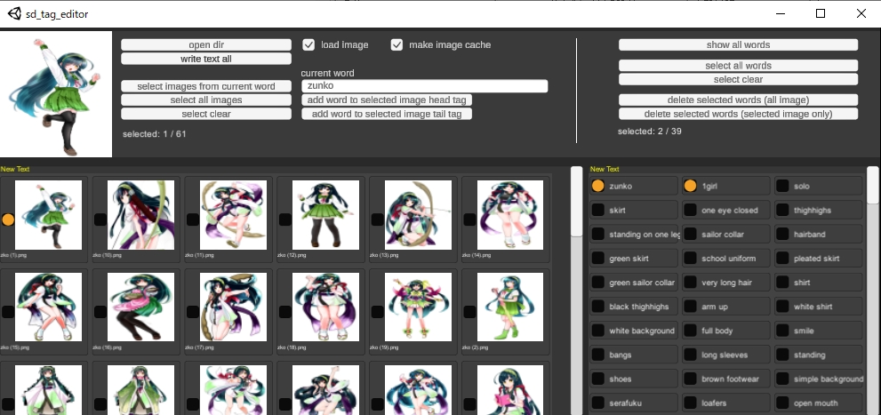

# stable-diffusion-simple-tag-editor

## What is this?

This is an editor for tagging image datasets.
This application assumes that images and txt are placed in the same folder hierarchy, please generate txt files with wd14-tagger before using this application.

## Usage

1. `open dir`
2. edit tags
   - `current word`: currently focuse tag word
   - `add word to selected image head tag `: append current word to the top of tag-list of the selected images
   - `add word to selected image tail tag `: append current word to the end of tag-list of the selected images
3. `write text all`
